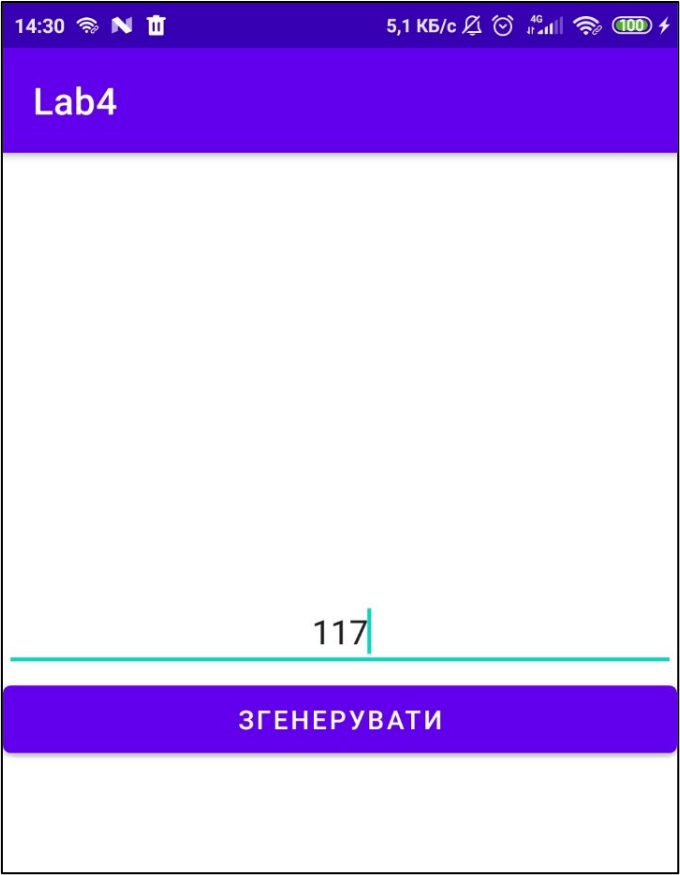
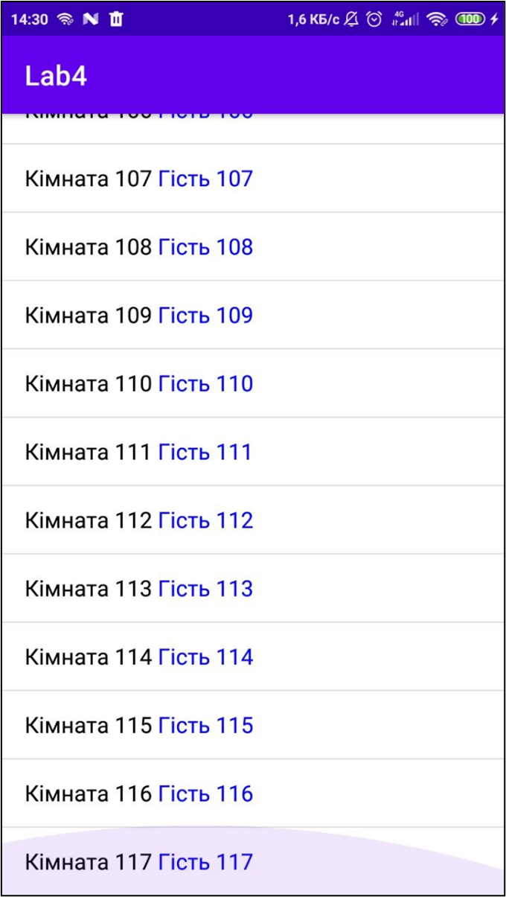

# Лабораторна робота №4.

## Виведення на екран згрупованої графічної і текстової інформації за допомогою контейнерів ListView та GridView мовами Xml і Java

### Результати роботи

	
	

<!--  -->

